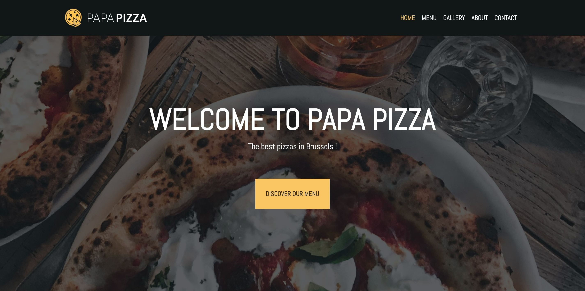
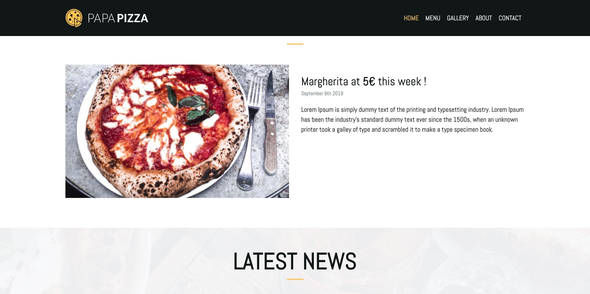
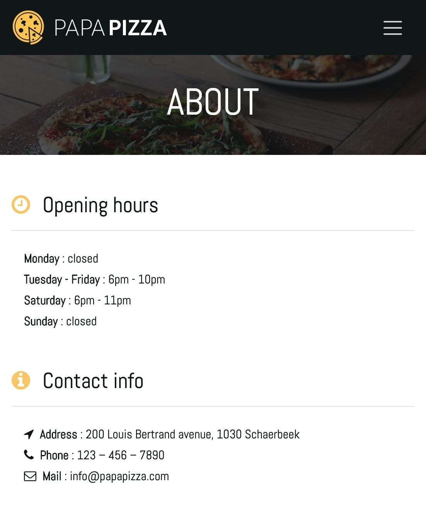

# Papa Pizza restaurant website
The purpose of this project is to create a responsive restaurant website in bootsrap following [this briefing](https://github.com/becodeorg/BXL-Johnson-4.14/blob/master/03-HTML-CSS/bootstrap/restaurant.adoc).

## Built with

* [Bootstrap 4](https://getbootstrap.com/)

## Resources

### Images

* [Pexels](https://www.pexels.com/) 
* [Pixabay](https://pixabay.com/fr/)
* [Free Vector](http://freevector.co/)

## Author

* Adrien Di Prima

## Screenshots

